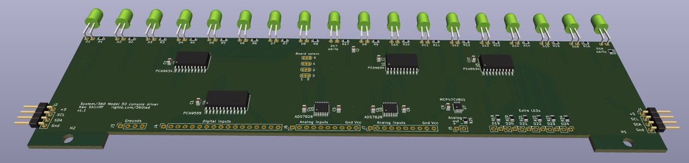

This is a driver board for the Model 50 console lights (under development).
This board has 18 LEDs, matching the two-byte display segment on the console.
It would take 15 boards for the whole console, which has approximately 271 LEDs.
I'm planning to use yellow/orange 590nm LEDs which is what the [IBM 1620 Jr](https://github.com/IBM-1620/Junior) project used after a bunch of testing to see what matched the bulbs most closely.

The board uses [PCA9634](https://www.nxp.com/docs/en/data-sheet/PCA9634.pdf) LED I2C PWM driver chips.
Each chip drives 8 LEDs, so each board has three chips. The extra 6 LED outputs are wired and can be connected to other console LEDs.
This supports the irregular console lights that don't fit into groups of 18.

The LED chips have I2C addresses *001bbbb*,
*011bbbb*, and *101bbbb* where *bbbb* are the board bits from the solder jumpers. The first two bits select the chip on the board (0, 1, 2).
The first chip handles the low-order byte, the second chip handles the high-order byte, and the third chip handles the two parity lights.

The board has some optional functionality that can be installed as needed.

A [PCA9555](https://www.nxp.com/docs/en/data-sheet/PCA9555.pdf) 16-bit GPIO can read 16 switches from the console.
Its I2C address is *0100bbb*.

A [MCP47CVB01](https://ww1.microchip.com/downloads/en/DeviceDoc/MCP47CXBXX-Data-Sheet-DS20006089B.pdf) DAC chip provides a current to drive the console meter. Its I2C address is *10010bb*.

Two [ADS7828EB](https://www.ti.com/lit/gpn/ads7828) provide 8-channel analog-to-digital conversion.
This can read the console potentiometers.
The I2C addresses are *100100b* and *100101b*, using a single board bit. The second-last bit selects the chip on the board.
