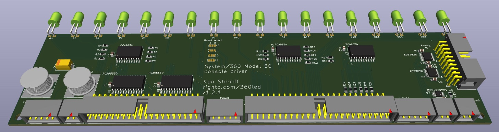

This is a driver board for the Model 50 console lights (under development).
This board has 18 LEDs, matching the two-byte display segment on the console.
It would take 15 boards for the whole console, which has approximately 271 LEDs.
I'm planning to use yellow/orange 590nm LEDs which is what the [IBM 1620 Jr](https://github.com/IBM-1620/Junior) project used after a bunch of testing to see what matched the bulbs most closely.

The board uses [PCA9634](https://www.nxp.com/docs/en/data-sheet/PCA9634.pdf) LED I2C PWM driver chips.
Each chip drives 8 LEDs, so I use three chips. The extra 6 LED outputs are wired and can be connected to other console LEDs.
This supports the irregular console lights that don't fit into groups of 18.

The chips have I2C addresss *aaaa001*, *aaaa011*, and *aaaa101*, where *aaaa* address bits select the board based on jumpers, the next two bits select the chip on the board, 0, 1, or 2, and the low-order bit is 1 to avoid conflicts with the chip's other addresses.
The first chip handles the low-order byte, the second chip handles the high-order byte, and the third chip handles the two parity lights.
